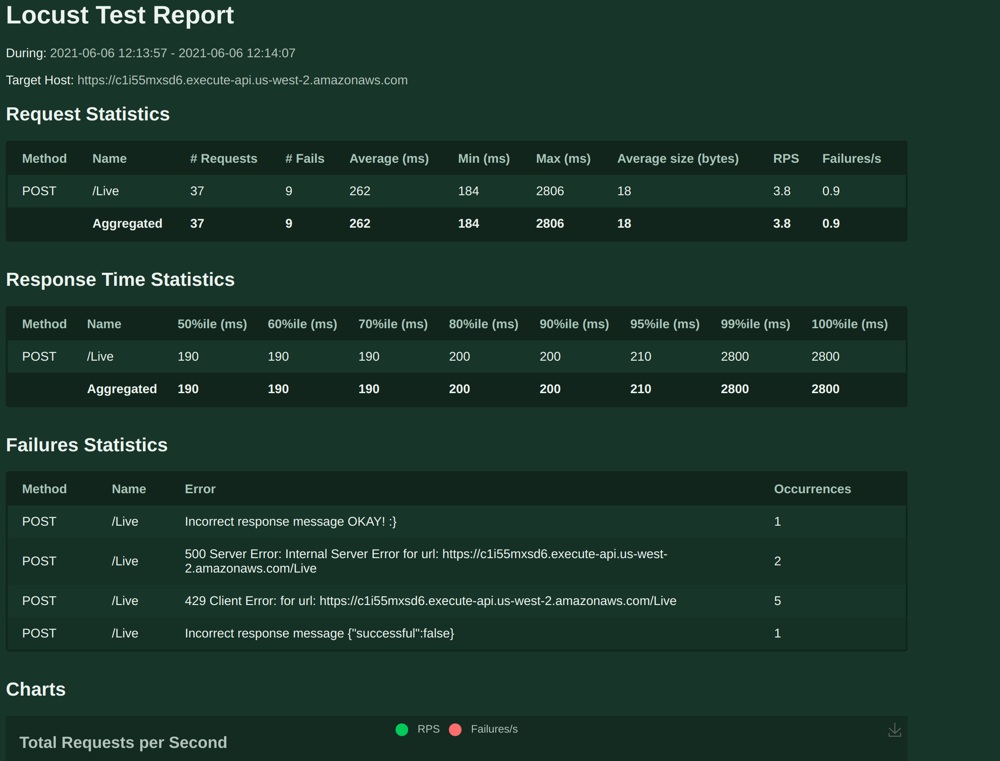

# Load Testing an API

To make life simple I have used [locust](https://github.com/locustio/locust) a well known load testing library/application.

The application has been setup so that it can be run with 

 `./run.py`

this should create a virtual environment and install all the requierments needed for the application.

There are 2 config files to use for this test.

`config.py` which configures the locust application

`mparticle_config.py` which configures the tests


Some basic print logging is generated by the application to the console, but the real value is held in the generated output files.

A html file viewable in a web browser that could be served with an CI/CD testing environment

```
results.html
```



The raw results data

```
mparticle_stats.csv
mparticle_stats_history.csv
mparticle_failures.csv
mparticle_exceptions.csv
```

These files are excluded from git as the output will change on each run.

# Initial Tests


Initial tests to confirm behavior of the API were done manually using POSTMAN.

## Incorrect API Key

{"message":"Forbidden"}

## Bad Json

{ "error": "correctly formatted json body is required"

## Good Json we see a variety of error conditions

{"successful":true}
{ "error": "json body is required"

## Exported request to curl

```
curl --location --request POST 'https://c1i55mxsd6.execute-api.us-west-2.amazonaws.com/Live' \
--header 'X-Api-Key: RIqhxTAKNGaSw2waOY2CW3LhLny2EpI27i56VA6N' \
--header 'Content-Type: application/json' \
--data-raw '{
    "name": "Martin Stevens",
    "date": "1/1/2023",
    "requests_sent": 1
}'
```

# Notes

Things to update.

The API key is currently in the repo. as this is a limited/demo key this is not an issue, but should we be testing on a live server we should call the API key from a secrets management system.
